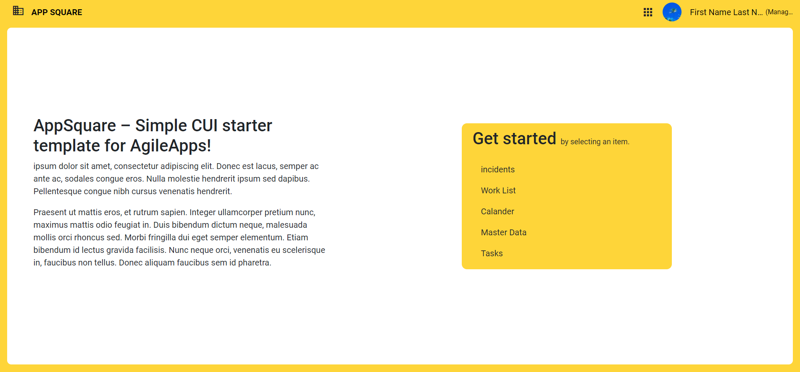

# App Square (CUI template)
This is a starter CUI template for AgileApps platform. It contains the [CUI template](./packages/cui-template) and the [source code](./template/source/).



[More previews](./docs/previews.md#record-detail-pages) of this template.


## Prerequisites:
   * Knowledge of AgileApps platform.
   * Knowledge of Angular framework.
## Supported AgileApps Platform Versions   
   *  10.13.5 and later
## Usage instructions
### Installing App Square CUI template
- Download the [CUI template file](./packages/cui-template/app-square-tmpl.zip).
- Follow the [CUI template instructions](https://docs.webmethods.io/AgileApps/getting_started/deployment/#installing_a_template)

## Customizing the App Square template
To customize this CUI template, follow the below instructions:

```bash
# Step 1
git clone https://github.com/agileapps-dev-com/app-square.git

# Step2 cd to template source directory
cd app-square\template\source

# Step 3: install dependencies
npm install
``` 

### How to use Proxy during development 
- Update the "target" property value in **proxy.conf.json**  to point to AgileApps environment (10.13.5+). eg: replace `https://agileappsinstance-hostname` with the AgileApps' instance host name.

```json
{
  "/networking": {
    "target": "https://agileappsinstance-hostname",
    "secure": false,
    "changeOrigin": "true"
  },
  "/ace-lib": {
    "target": "https://agileappsinstance-hostname",
    "secure": false,
    "changeOrigin": "true"
  }
}
```

### Start the Application
- Use the below command
```bash
ng serve
```
> The app will run at https://localhost:4211/

### Build the Application
- After the customization is completed, run the following command to build the application:
```bash
ng build --prod
```
> The prod built artifacts will be available in `~template/source/dist/record-panel-view` directory.

### create the template meta file
- After a successful build, create a JSON file named  `template-details.json` and add the following content, and place this file inside the prod built artifact folder 

```json
{
  "name": "AppSquareTemplate",
  "version": "2.0"
}
```
- Create a zip folder `~template/source/dist/record-panel-view` and follow the instructions for [deployment](https://docs.webmethods.io/AgileApps/getting_started/deployment/#gsc.tab=0).

## Disclaimer
Refer to the [licence](LICENSE) terms and conditions.
